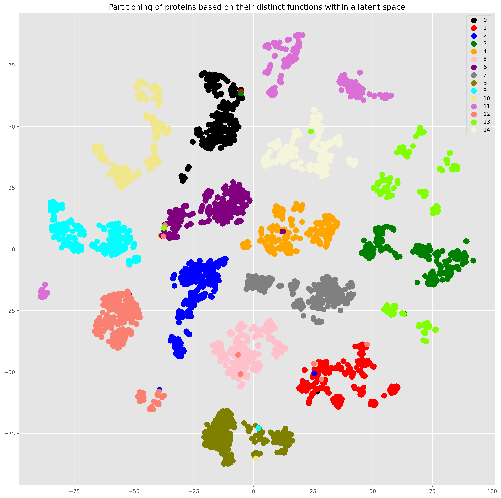
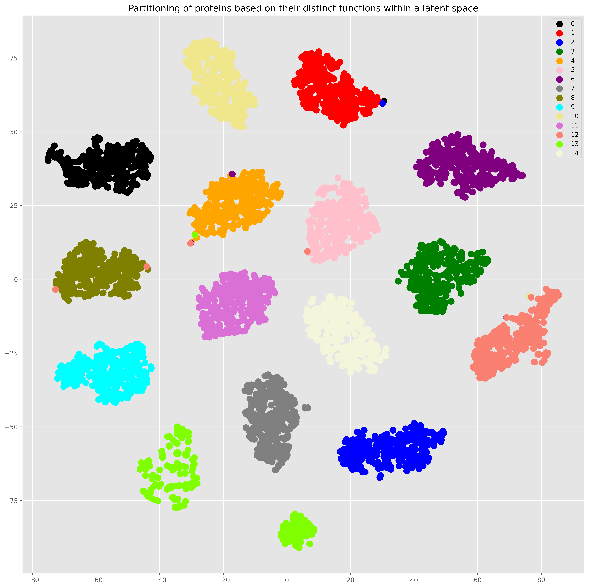
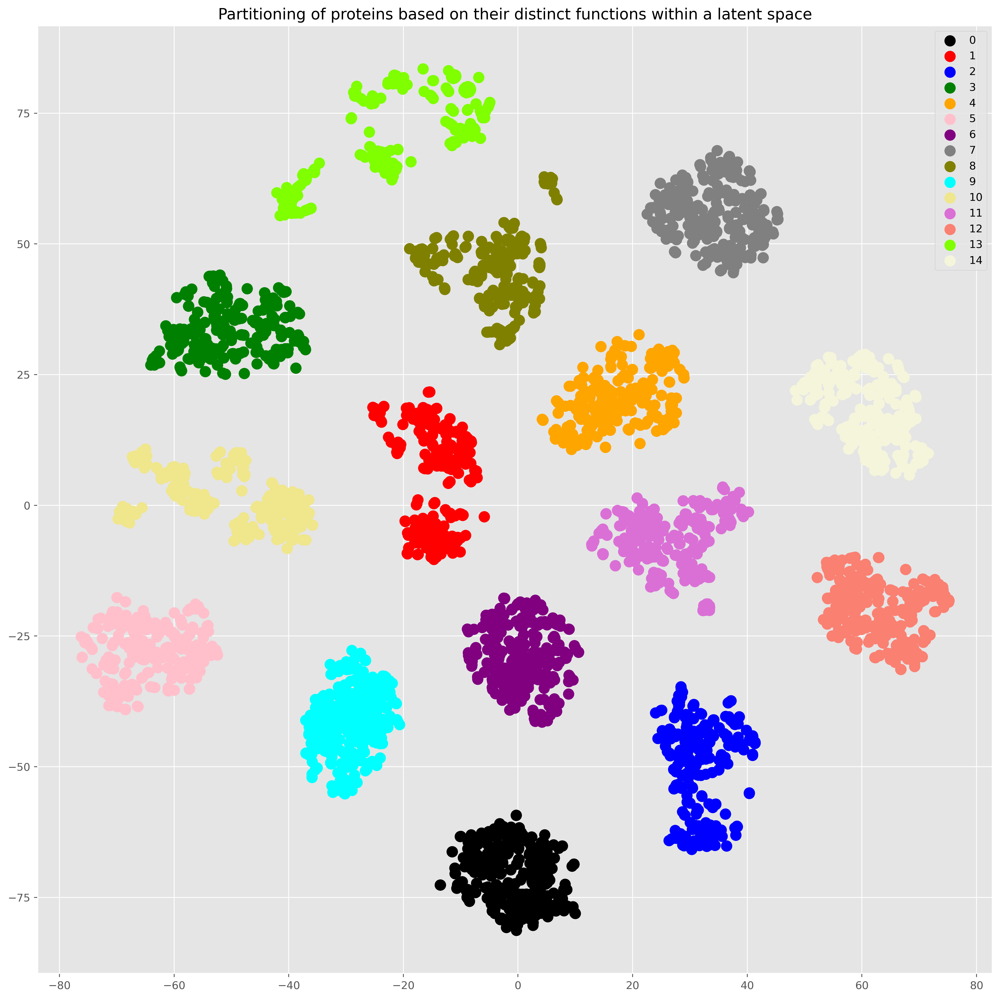
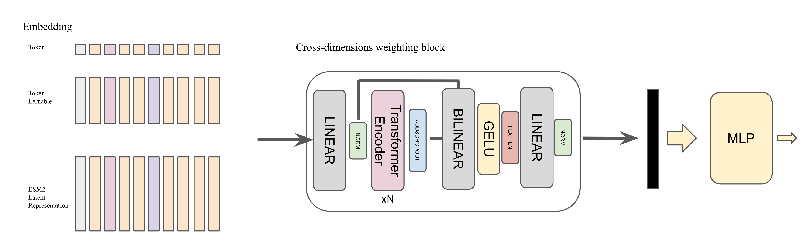

# UHC: Uncovering the Hidden Code: A Study of Protein Latent Encoding
---

<p  align="center"  width="100%">
 


</p>



> **Uncovering the Hidden Code: A Study of Protein Latent Encoding**
>           
> [Riccardo Tedoldi](https://www.instagram.com/riccardotedoldi/)
>
> Supervisor: [Jacopo Staiano](https://scholar.google.com/citations?user=hI5X8UYAAAAJ&hl=en)
>
> *Applied NLP Project, Spring 2023* 


<em>The figures show the separation of proteins that do different things in the latent space. Once the network has been trained to perform a downstream task. The learned latent space captures the details and characteristics of what the protein does. I used different colours to characterise different proteins for which we have statistical evidence that they have similar functions. Because of the sequence similarity. The figures are shown in this order: `img-clusters-token.png`; `img-clusters-nn.EMBEDDING.png`; `img-clusters-ESM2.png`. I discuss the results figures in more detail in the [report](https://drive.google.com/file/d/14VLPiCDF7ntZ2c0Nc70Fu9qHq1o7pIpS/view?usp=sharing).</em>

---

## Table of Contents 

- [Installation](#Installation): Instructions on how to install and set up the project locally. Include any dependencies that need to be installed.
- [Usage](#Usage): Instructions on how to use the project.
- [Contributing](#Contributing): Instructions on how to contribute to the project.
- [License](#License): Information about the project's license.

## Installation

I report here the file to create a conda environment with all the requirements.

``` bash
conda create --name <env-name> --file ./requirements.txt
```

Then, you can activate the environment with:

``` bash
conda activate <env-name>
```

### Dataset

I release the data used in the experiments in a [google drive folder](https://drive.google.com/drive/folders/1IRZZGuC8f9lrTxA5k1fG8uOUA58Tkkym?usp=sharing). The structure of the folder is the following:

```
data
├───proteins
│   ├───albumin
│   │   ├───sequences_bpe
│   │   │   |___ BPE_model_albumin.model
│   │   │   |___ BPE_model_albumin.vocab
│   │   │   |___ sequences_BPE_str.pkl
│   │   │   |___ sequences_BPE.pkl
│   │   |   |___ sequences_pck.pkl
│   │   |   |___ sequences.fasta
│   │   |   |___ sequences.txt
|   |   |___ GenBank-id.fasta
│   ├───aldehyde
|   |   |___ ...
│   ├───catalase
|   |   |___ ...
│   ├───collagen
|   |   |___ ...
│   ├───elastin
|   |   |___ ...
│   ├───erythropoietin
│   |   |___ ...
│   ├───fibrinogen
│   |   |___ ...
│   ├───hemoglobin
│   |   |___ ...
│   ├───immunoglobulin
│   |   |___ ...
│   ├───insulin
│   |   |___ ...
│   ├───keratin
│   |   |___ ...
│   ├───myosin
│   |   |___ ...
│   ├───protein_kinase
│   |   |___ ...
│   ├───trypsin
│   |   |___ ...
│   ├───tubulin
│   |   |___ ...
├───token_axa
│   ├─── proteins_tokenized_padded.pt
|   |___lightning_logs
├───token_axa_nn_embedding
│   ├─── proteins_tokenized_padded.pt
|   |___lightning_logs
├───esm2
│   ├─── esm_embedding_0_3.pkl
│   ├─── esm_embedding_4_7.pkl
│   ├─── esm_embedding_8_10.pkl
│   ├─── esm_embedding_11_14.pkl
│   ├─── esm_embedding_label.pkl
|   |___ esm_sequences_dict.pkl
|   |___experiment
|   |    |___ esm_X_embedding_dataset_AVG.pt
|   |    |___ pred_emb.pt
|   |    |___ pred_label.pt
|   |    |___lightning_logs
|___human_gene_go_term
|   |___ uniprot-annotations.fasta
|   |___ uniprot-annotations.tsv
|   |___ with_structure_uniprot-annotations.fasta
|   |___ with_structure_uniprot-annotations.tsv
|   |___ dictionary_all_go_tensor_padded.pkl
|   |___ dictionary_all_go_tensor.pkl
|   |___ dictionary_all_go.pkl
__________________________________________________
```

Concerning the `human_gene_go_term` I retrieved the go term of almost 20000 human gene. Additionally, I have the pre-computed embedding of them obtainded using [ProtBERT](https://www.biorxiv.org/content/10.1101/2020.07.12.199554v3). The latent representation of them is available [residue-per-residue](https://ftp.ebi.ac.uk/pub/contrib/UniProt/embeddings/current_release/UP000005640_9606/per-residue.h5) or [per-protein](https://ftp.uniprot.org/pub/databases/uniprot/current_release/knowledgebase/embeddings/UP000005640_9606/per-protein.h5). In order to facilitate further investigations, I found the precomputed embedding [per-protein](https://ftp.uniprot.org/pub/databases/uniprot/current_release/knowledgebase/embeddings/uniprot_sprot/per-protein.h5) of the entire Swiss-Prot database. In the corresponding notebook, in the folder `experiments`, you can find the code to extract the embedding.

Additionally, in the folders you can find also jupyter-notebooks with the architectures and the models checkpoints. The moldels checkpoints are available also here under the folder `experiments > model_ckpt`.

## Usage

In the folder `experiments`, you can find scripts and juptyer notebooks to run the experiments. The jupyter notebooks are self-explanatory. In the file `module.py` inside the folder `experiments`, you can find the functions implemented to preprocess the data. In separate files you can find the architecture implemented in each version. Inside the `experiments` folder you will find an additional short description for each file.

The folder `img`, contains the images of the cross-weighting block and the architecture proposed in the discussion of the paper. Additionally, you can find the images of the results of the experiments. Specifically, the images are the following:
- `img-crossweighting.png`: the [cross-weighting block](https://github.com/r1cc4r2o/UHC/blob/main/img/img-crossweighting.png);
- `img-architecture.png`: the [architecture proposed](https://github.com/r1cc4r2o/UHC/blob/main/img/img-architecture.png) in the discussion of the report;
- `img-table-metrics.png`: the [table with the metrics trend](https://github.com/r1cc4r2o/UHC/blob/main/img/img-table-metrics.png);
- `img-clusters-token.png`: the [clusters](https://github.com/r1cc4r2o/UHC/blob/main/img/img-clusters-token.png) obtained by the model using a fixed vocabulary;
- `img-clusters-nn.EMBEDDING.png`: the [clusters](https://github.com/r1cc4r2o/UHC/blob/main/img/img-clusters-nn.EMBEDDING.png) obtained by the model using a learnable vocabulary;
- `img-clusters-ESM2.png`: the [clusters](https://github.com/r1cc4r2o/UHC/blob/main/img/img-clusters-ESM2.png) obtained by the model using the ESM2 embedding;

---
> 🚧🚧 Other investigations discussed in the [report](https://drive.google.com/file/d/14VLPiCDF7ntZ2c0Nc70Fu9qHq1o7pIpS/view?usp=sharing) are under development 🚧🚧.
---

## Contributing

We have made our implementation publicly available, and we welcome anyone who would like to join us and contribute to the project.
### Contact
If you have suggestions or ideas for further improvemets/research please feel free to contact me.
- riccardo tedoldi: [@riccardotedoldi](https://www.instagram.com/riccardotedoldi/)

## License

The code is licensed under the MIT license, which you can find in the LICENSE file.

## To cite this work

```bibtex
@misc{Tedoldi2023,
    title   = {Uncovering the Hidden Code: A Study of Protein Latent Encoding},
    author  = {Riccardo Tedoldi},
    year    = {2023},
    url  = {https://github.com/r1cc4r2o/UHC}
}
```